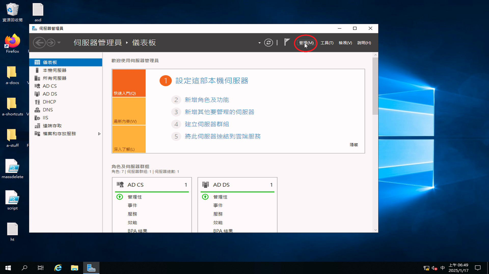
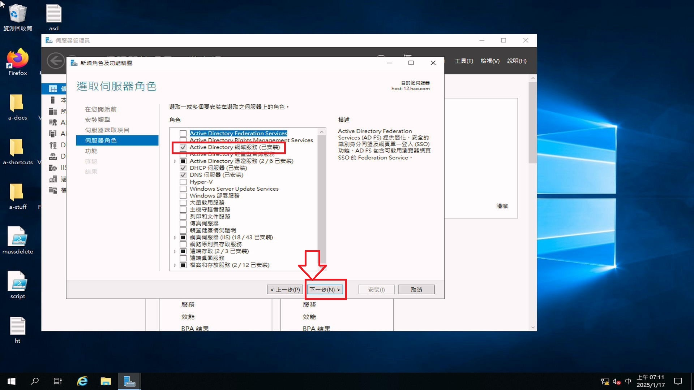
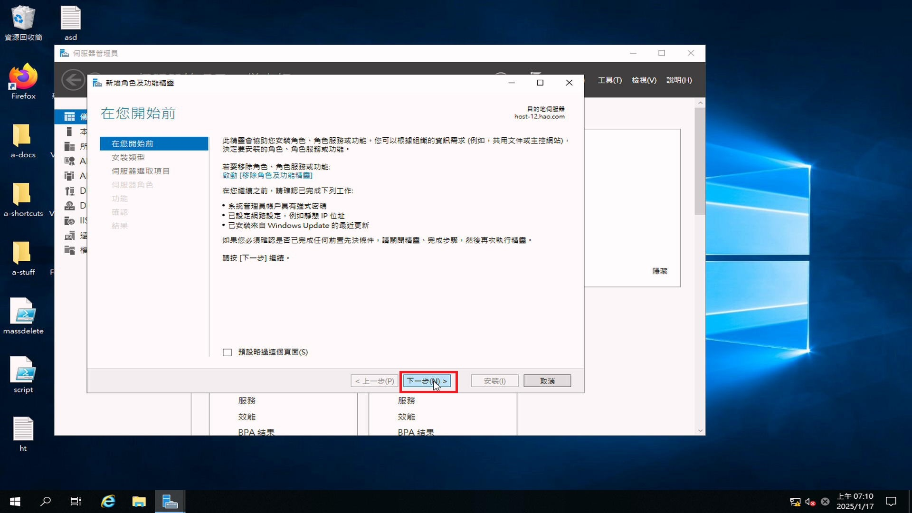
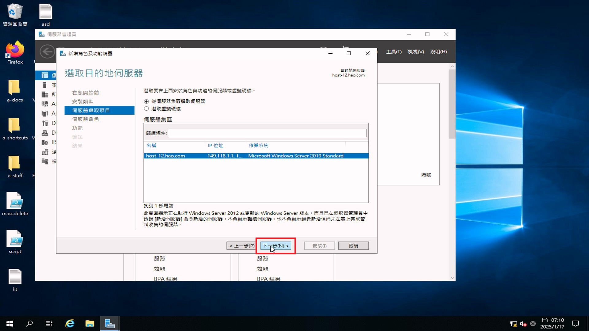
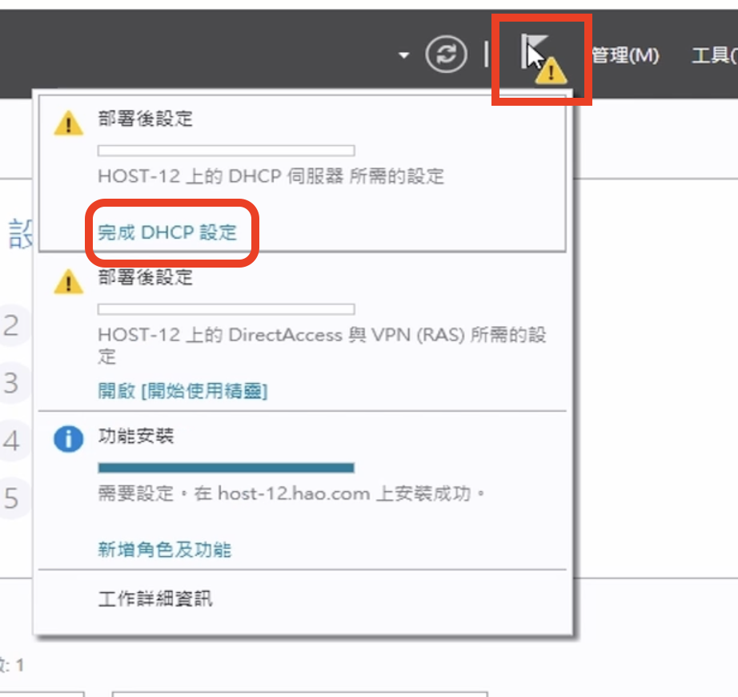
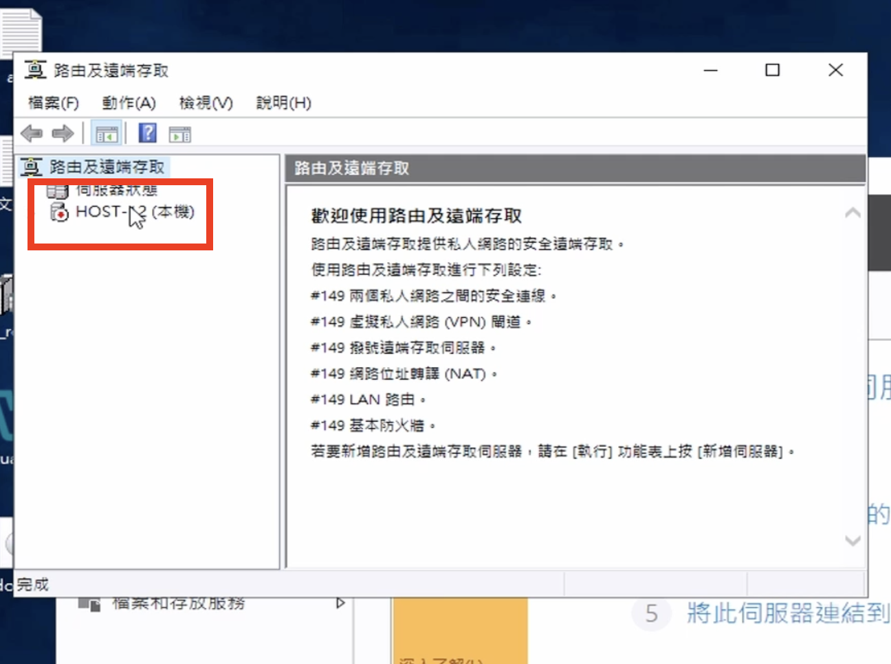
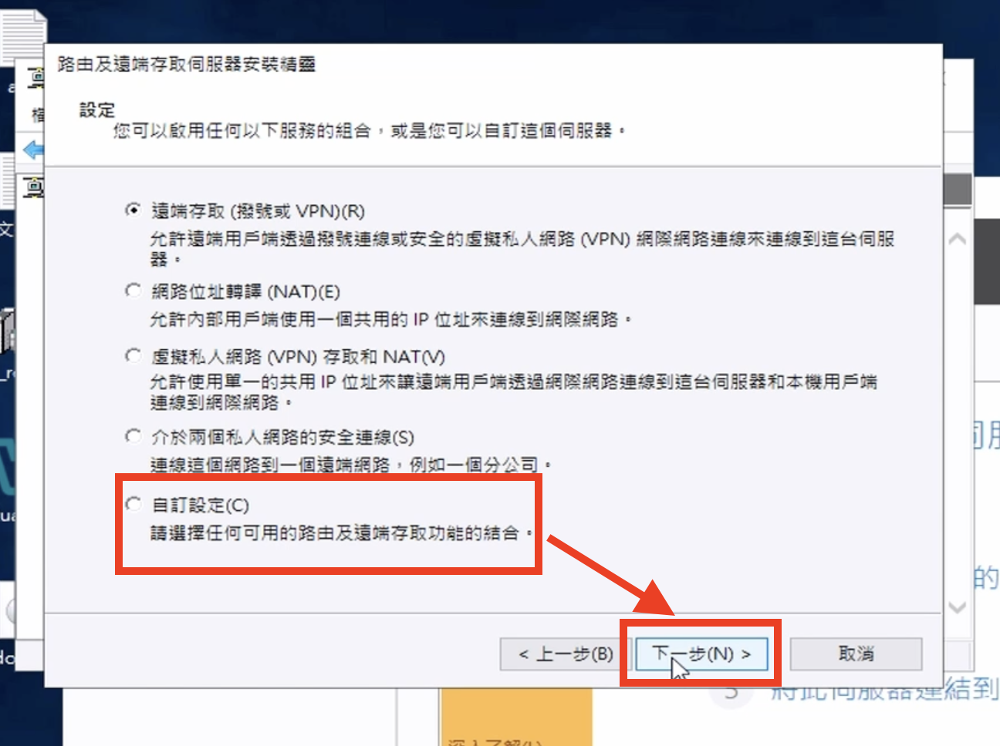
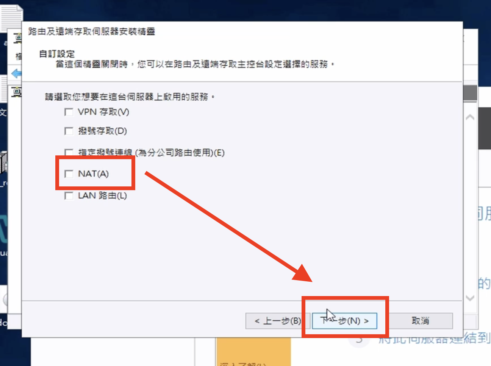

# 設定 DHCP 與 NAT
## 影片教學
<video width="560" height="315" controls>
  <source src="/videos/ap-5.srv-content.mp4" type="video/mp4">
  Your browser does not support the video tag.
</video>

## 步驟
1. 按管理

2. 按新增角色與功能

3. 下一步，下一步，下一步

4. 選擇安裝 **DHCP** 和 **NAT**

5. 下一步，下一步

6. 在這裡 按 路由

7. 下一步，安裝

8. 按上面的通知，並按 **完成DHCP設定**

9. 下一步，下一步，認可
 
--------DHCP裝完了---------

10. 按上面的通知，並按 **開啟「開始啟用精靈」**

 

11. 選擇只部署VPN

12. 在本機的選項上選擇第一個選項 **設定**

13. 在初始畫面按下一步，並在下一頁按自訂

14. 選擇 NAT 並按下一步

15. 完成，並啟動服務

16. 點進去本機，並選擇 IPv4 

17. 選擇 NAT， 設立防火牆 

18. 設定
  - LAN
      - 用私人介面
  - WAN
      - 用公共網路，並啟用NAT(防火牆)

-----------設定完了-----------

之後我需要設定ssh端口時，我們會回來到同一個程式，並更改端口設定。